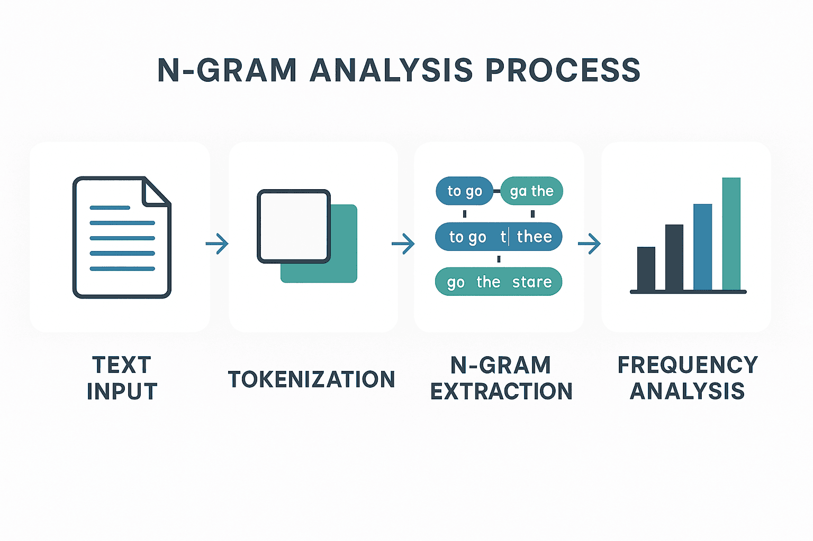

# Quranic Syllable N-gram Analysis 📖🔢

A computational analysis of syllabic patterns in the complete Quran using N-gram frequency analysis, longest pattern identification, and an investigation of the Number 19 Phenomenon across 210,545 syllables from 6,236 verses.

<div align="center">
  
</div>

<br>
<div align="center">
  <a href="https://codeload.github.com/TendoPain18/quranic-syllable-ngram-analysis/legacy.zip/main">
    
  </a>
</div>

## 📋 Description

This project performs a comprehensive statistical analysis of syllabic patterns in the Quran using N-gram techniques. The dataset is a syllable-segmented transcription of the full Quran (Hafs narration standard), covering all 114 Suras and 6,236 verses. The analysis covers three tasks: identifying the most frequent N-gram patterns, finding the longest N-gram sequences by character count, and investigating the mathematical "Number 19 Phenomenon" in syllable counts.

## 🎯 Project Objectives

1. Load and parse the Quran syllable transcription file, mapping each syllable to its Surah and Ayah
2. Find the top 10 most common syllable N-gram patterns for sizes 1, 3, 4, and 5
3. Identify the longest N-gram for each size (1–5) by total character count
4. Investigate the Number 19 Phenomenon: Suras, verses, and 19-syllable sequences divisible by 19

## ✨ Features

- **Complete Quran Coverage**: 114 Suras, 6,236 verses, 210,545 syllables, 2,097 unique syllables
- **Multi-size N-gram Analysis**: Frequency analysis for unigrams through 5-grams
- **Location Tracking**: Each syllable and N-gram mapped to its exact Surah and Ayah
- **Longest Pattern Finder**: Identifies N-grams with maximum combined character length
- **Number 19 Analysis**: Three-part investigation of divisibility patterns across the Quran

## 📊 Results

### Task 1: Most Frequent N-gram Patterns

**Top 5 Unigrams (1-gram):**

| Rank | Syllable | Frequency | Top Surah |
|------|----------|-----------|-----------|
| 1 | وَ | 8,776 | Al-Baqarah (694) |
| 2 | لَ | 7,274 | Al-Baqarah (619) |
| 3 | لَاْ | 6,680 | Al-Baqarah (600) |
| 4 | نَ | 6,650 | Al-Baqarah (478) |
| 5 | مَاْ | 3,742 | Al-Baqarah (305) |

**Most Common 3-gram:** لَ-ذِيْ-نَ (1,018 occurrences) — Al-Baqarah (81), Al-Imran (61), An-Nisa (59)

**Most Common 5-gram:** لَ-ذِيْ-نَ-ءَاْ-مَ (242 occurrences) — Al-Baqarah (26), Al-Ma'idah (24), An-Nisa (17)

---

### Task 2: Longest N-gram Patterns by Character Count

| N | Characters | Pattern | Location |
|---|-----------|---------|----------|
| 1 | 6 | حِيْمْ | Al-Fatiha, Verse 1 |
| 2 | 12 | ضَاْلْ-لِيْنْ | Al-Fatiha, Verse 7 |
| 3 | 18 | لَاْمْ-مِيْمْ-صَاْدْ | Al-A'raf, Verse 1 |
| 4 | 24 | مِيْمْ-عَيْنْ-سِيْنْ-قَاْفْ | Ash-Shura, Verse 1 |
| 5 | 28 | حِيْطْ-حَاْ-مِيْمْ-عَيْنْ-سِيْنْ | Fussilat, Verse 54 |

---

### Task 3: The Number 19 Phenomenon

**Suras with syllable counts divisible by 19 (8 out of 114):**

Al-An'am (8,246), Al-Ankabut (2,717), Al-Jathiyah (1,311), Muhammad (1,558), Al-A'la (190), Al-Balad (209), Ad-Duha (114), At-Takathur (76)

**Verses divisible by 19:** 253 out of 6,236 (4.06%)

**19-gram analysis:**
- Total distinct 19-grams: 207,502
- Repeated 19-grams: 2,531
- Most repeated pattern: 8 occurrences across the Quran

## 🚀 Getting Started

### Prerequisites

```
Python 3.7+
nltk
```

```bash
pip install nltk
```

### Usage

```bash
git clone https://github.com/TendoPain18/quranic-syllable-ngram-analysis.git
cd quranic-syllable-ngram-analysis
jupyter notebook Untitled16.ipynb
```

Place the `quran_syl.txt` syllable transcription file in the same directory before running.

## 🙏 Acknowledgments

- Course: Speech Processing — Communications and Information Engineering, Zewail City University of Science and Technology

<br>
<div align="center">
  <a href="https://codeload.github.com/TendoPain18/quranic-syllable-ngram-analysis/legacy.zip/main">
    
  </a>
</div>

## <!-- CONTACT -->
<!-- END CONTACT -->

## **Uncovering the linguistic patterns of the Quran through computation! 📖✨**
